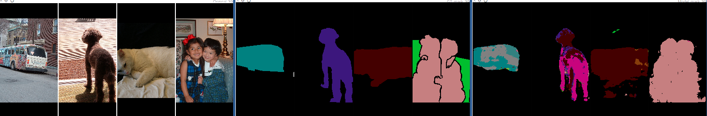
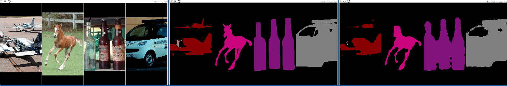

## Semantic Segmentation

Semantic segmentation implementation using pytorch framework.
* **Fully Convolutional Networks for Semantic Segmentation**[\[paper\]](https://people.eecs.berkeley.edu/~jonlong/long_shelhamer_fcn.pdf)  
  *Jonathan Long, Evan Shelhamer, Trevor Darrell*
* **U-Net: Convolutional Networks for Biomedical Image Segmentation** [\[paper\]](https://arxiv.org/abs/1505.04597)  
  *Olaf Ronneberger, Philipp Fischer, Thomas Brox*
* **Pyramid Scene Parsing Network** [\[paper\]](https://arxiv.org/abs/1612.01105)  
  *Hengshuang Zhao, Jianping Shi, Xiaojuan Qi, Xiaogang Wang, Jiaya Jia*
* **Learning a Discriminative Feature Network for Semantic Segmentation** [\[paper\]](http://openaccess.thecvf.com/content_cvpr_2018/CameraReady/0632.pdf)  
  *Changqian Yu, Jingbo Wang, Chao Peng, Changxin Gao, Gang Yu, Nong Sang*

### Currnet
- FCN8
- U-Net
- PSPNet
- DFNet (CVPR 2018, Implemented part of network)

### Some details

* I changed some parts of network to lighten network.
* I used augmented dataset. (Currently, I only applied flip operation for augmentation.)

### Some results (Updated soon)

*GT images-GT masks-Model predictions*  

***Pascal VOC 2012 / U-Net***

***Pascal VOC 2012 / FCN8***

### TODO

- [ ] Add Cityscape dataset
- [ ] Add Semantic boundary dataset
- [ ] Add poly learning rate policy
- [ ] Change cuda dependency from nsml to local gpu
- [x] ~~Data argumentation~~
- [ ] DeepLab v3 / DeepLab v3+
- [ ] Remaining part of DFNet
- [ ] Training result

### Dependencies
* [python 3.5+](https://www.continuum.io/downloads)
* [PyTorch 0.4.1](http://pytorch.org/)

### Contact
*If you have any questions about codes OR find something wrong in my codes, please let me know.*
